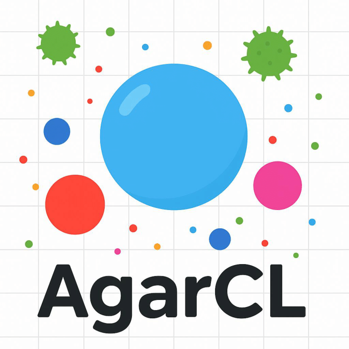
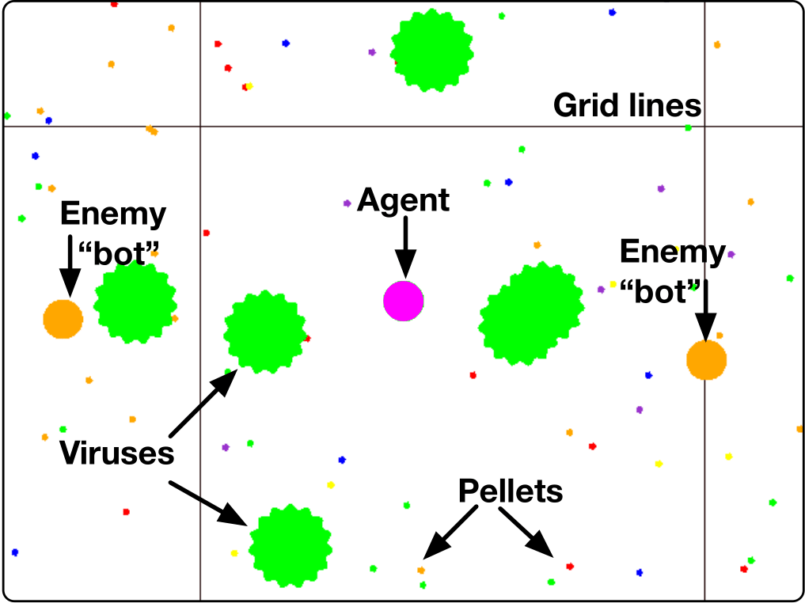

# AgarCL

<div align="center">
    
</div>


A research platform for continual RL that allows for a progression of increasingly sophisticated behaviour.

<div align="center">
    
</div>

**AgarCL is based on the game Agar.io.** It's a non-episodic, high-dimensional problem featuring stochastic, ever-evolving dynamics, continuous actions, and partial observability.

## Installation instructions

The recommended way to use AgarCL is within a Docker container running a Linux OS. This ensures there are no conflicts with other installed packages or platforms. This installation script will allow you to interact with AgarCL in a headless mode.

### Setting up the container
Follow these steps to set up the container:

1. **Download the Dockerfile**
   - Download the [Dockerfile.txt](https://github.com/AgarCL/AgarCL/blob/master/Dockerfile.txt).

2. **Navigate to the Directory Containing the Dockerfile**
   - Open your terminal and navigate to the folder where the `Dockerfile.txt` is located:
     ```bash
     cd /path/to/Dockerfile/directory
     ```

3. **Build the Docker Image**
   - Build the Docker image by specifying the custom Dockerfile using the `-f` flag:
     ```bash
     docker build -f Dockerfile.txt -t agarclimage .
     ```

4. **Run the Docker Container**
   - Once the image has been built, run the container:
     ```bash
     docker run --gpus all -it --name agarclcontainer agarclimage
     ```
   - This command will start the container with the name `agarclcontainer`. The `--gpus all` flag tells Docker to use all available GPUs on your host system for the container.

### Installing the AgarCL Platform

Now, let's install the platform on your system (`agarclcontainer` container):

1. **Clone the AgarCL Repository**
   - Clone the repository with the `--recursive` flag to ensure all submodules are included:
     ```bash
     git clone --recursive git@github.com:AgarCL/AgarCL.git
     ```

2. **Install the Platform**
   - Change into the `AgarCL` directory:
     ```bash
     cd AgarCL
     ```

   - Run the installation command to set up the platform:
     ```bash
     python3 setup.py install --user
     ```

   - This will install the platform in your local user environment.

#### Done!

### Installing the AgarCL Platform and benchmarking tools

1. **Clone the AgarCL-benchmark Repository**
   - Clone the repository:
     ```bash
     git clone git@github.com/AgarCL/AgarCL-benchmark.git
     ```

2. **Navigate to the AgarLE-Benchmark Directory**
   - Change into the `AgarCL-benchmark` directory:
     ```bash
     cd AgarCL-benchmark
     ```

4. **Clone the AgarCLgit  Repository**
   - Clone the `AgarCL` repository with the `--recursive` flag to ensure all submodules are included:
     ```bash
     git clone --recursive git@github.com:AgarCL/AgarCL.git
     ```

5. **Navigate to the AgarCL Directory**
   - Change into the `AgarCL` directory:
     ```bash
     cd AgarCL
     ```

6. **Install the Platform**
   - Run the installation command to set up the platform:
     ```bash
     python setup.py install --user
     ```

#### Done!

### macOS Installation Guide

Follow the instructions [here](https://brew.sh/) and make sure you have homebrew correctly installed and updated.

Then follow these steps to set up the AgarCL environment on macOS:

1. **Clone the repository:**
   ```bash
   git clone --recursive git@github.com:AgarCL/AgarCL.git
   ```
2. **Change into the project directory:**
   ```bash
   cd AgarCL
   ```
3. **Create a Python virtual environment:**
   ```bash
   python3 -m venv agarclenv
   ```
4. **Activate the virtual environment:**
   ```bash
   source agarclenv/bin/activate
   ```
5. **Run the installer script:**
   ```bash
   ./install.sh
   ```
6. **Install Python dependencies:**
   ```bash
   pip install -r requirements.txt
   ```
7. **Build & install the Python package:**
   ```bash
   python3 setup.py install
    ```

#### Done!

### Linux Installation Guide

1. **Clone the repository:**
   ```bash
   git clone --recursive git@github.com:AgarCL/AgarCL.git
   ```
2. **Change into the project directory:**
   ```bash
   cd AgarCL
   ```
3. **Create a Python virtual environment:**
   ```bash
   python3 -m venv agarclenv
   ```
4. **Activate the virtual environment:**
   ```bash
   source agarclenv/bin/activate
   ```
5. **Run the installer script:**
   ```bash
   ./install.sh
   ```
6. **Install Python dependencies:**
   ```bash
   pip install -r requirements.txt
   ```
7. **Build & install the Python package:**
   ```bash
   python3 setup.py install
    ```

## Running the code
To run the Go Bigger example, execute the following line: 

```python
python3 project_path/bench/go_bigger_example.py
```

To run the Screen Observations example, execute the following line: 

```python
python3 project_path/bench/screen_obs_example.py
```

## Using the environment


```python
import gymnasium as gym

# Initialise the environment
env = gym.make("agario-grid-v0", render_mode="human")

# Reset the environment to generate the first observation
observation = env.reset()
for _ in range(1000):
    # this is where you would insert your policy
    action_space = gym.spaces.Box(low=-1, high=1, shape=(2,))
    action = (action_space.sample(), np.random.randint(0, 3))

    # step (transition) through the environment with the action
    # receiving the next observation, reward and if the episode has terminated or truncated
    observation, reward, terminated, truncated, info = env.step(action)

    # If the episode has ended then we can reset to start a new episode
    if terminated or truncated:
        observation = env.reset()

env.close()
```

### Self-Play setup

In order to play the game yourself or enable rendering in the gym environment, you will need to build the game 
client yourself on a system where OpenGL has been installed. Issue the following commands:


```shell
git submodule update --init --recursive
mkdir build && cd build
cmake -DCMAKE_BUILD_TYPE=Release ..
make -j 2 client agario
```

This will output an executable named client in the directory agario

```shell
agario/client
```

Use your cursor to control the agent.


<!-- 

The Agar.io Learning Environment (AgarLE) is a performant implementation of the popular online multi-player game agar.io along with an [OpenAI Gym](https://gym.openai.com/) interface suitable for reinforcement learning in Python.

<p align="center">

</p>

<!-- # Prerequisites -->
<!-- Before you begin, ensure you have the following installed on your system:

- **CMake**: A cross-platform tool designed to build, test, and package software.
- **GLM**: A header-only C++ mathematics library for graphics software based on the OpenGL Shading Language (GLSL) specifications.
- **cxxopts**: Lightweight C++ command-line option parser.

Additionally, you will need to install some essential packages for OpenGL development: **GLFW** and **GLAD**. -->


<!-- ## Clone this repository (with submodules)
```sh
git clone --recursive git@github.com:AgarCL/AgarLE.git
```
# Installation 
Run the following line in the terminal:
```sh
cd agarLE
./install.sh
```

# Running the code

If you want the crafted observations and run it over python, execute the following line: ```project_path/bench/agarle_bench.py```

## Usage

Installation will have installed the python module `gym_agario`, which when imported
registers the AgarLE gym environments. You need only import `gym_agario` and then
make an environment in the standard way 

```python
import gym
import gym_agario
    
env = gym.make("agario-grid-v0")
    
game_state = env.reset()
print(game_state.shape) # (128, 128, 10) , (grid_size, grid_size, num_channels)

action = np.array([0, 0]), 0  # don't move, don't split
while True:
game_state, reward, done, info = env.step(action)
if done: break
```

The Agar.io game and observation space are highly configurable. You can change
the parameters of the game and observation properties like so (default configuration
shown).

```python
config = {
'ticks_per_step':  4,     # Number of game ticks per step
'num_frames':      2,     # Number of game ticks observed at each step
'arena_size':      1000,  # Game arena size
'num_pellets':     1000,
'num_viruses':     25,
'num_bots':        25,
'pellet_regen':    True,  # Whether pellets regenerate randomly when eaten
'grid_size':       128,   # Size of spatial dimensions of observations
'observe_cells':   True,  # Include an observation channel with agent's cells
'observe_others':  True,  # Include an observation channel with other players' cells
'observe_viruses': True,  # Include an observation channel with viruses
'observe_pellets': True   # Include an observation channel with pellets
}

env = gym.make("agario-grid-v0", **config)
``` -->
<!-- 
# Multi-Agent Environments

This gym supports multiple agents in the same game. By default, there will
only be a single agent, and the gym will conform to the typical gym interface
(note that there may still be any number of "bots" in the environment).
However, if you pass `"multi_agent": True` to the environment configuration
then the environment will have multiple agents all interacting within the
same agar.io game simultaneously.

    env = gym.make("agario-grid-v0", **{
        "multi_agent": True,
        "num_agents": 5
    })

With this configuration, the environment will no longer conform to the 
typical OpenAI gym interface in the following ways.

1. `step()` will expect a list of actions of the same length
as the number of agents, which specifies the action for each agent.

2. The return value of `step()` will be a list of observations,
list of rewards, and list of dones each with length equal to
the number of agents. The `i`'th elements of each lists
correspond to the `i`th agent consistently throughout the episode.

3. `reset()` will return a list of observations of length equal
to the number of agents.

4. When an agent is "done", observations for that agent will be None.
The environment may still be stepped while there is at least one agent
that is not "done". Only when all agents are done must the environment
be reset.

Note that if you pass `num_agents` greater than 1, `multi_agent`
will be set True automatically. -->

<!-- # Caveats

Currently compilation/installation is only working with Clang, so if you're
on Linux then you'll need to set your C++ compiler to Clang in your environment
before installing.

    CXX=`which clang++`

The only environment which has been tested extensively is `agario-grid-v0`,
although the RAM environment `agario-ram-v0` and screen environment `agario-screen-v0`
should work with some coaxing. The `agario-screen-v0` requires a window manager to
work so will not work on headless Linux machines, for instance. Calling `render`
will only work if the executable has been built with rendering turned on as can be
done by following the advanced set up guide. Rendering will not work
with the "screen" environment, despite the fact that that environment uses
the screen image as the environment's observation. -->

<!-- # Self-Play setup
In order to play the game yourself or enable rendering in the gym environment,
you will need to build the game client yourself on a system where OpenGL has
been installed. This is most likely to succeed on macOS, but will probably work
on Linux. Issue the following commands

    git submodule update --init --recursive
    mkdir build && cd build
    cmake -DCMAKE_BUILD_TYPE=Release ..
    make -j 2 client agarle

This will output an executable named `client` in the directory `agario`

    agario/client  # play the game

If you also build the `agarle` target, then a python-importable dynamic library
(i.e. `*.so` file) named `agarle` will have been produced. To use it, copy it
into the "site packages" for your Python interpreter like so:

    cp environment/agarle* `python -m site --user-site`

The underlying gym environments may be compiled such that calling `render()`
will render the game onto the screen. This feature is turned off by default
for performance and portability reasons, but can be turned on during
compilation by using the following cmake command instead of the one shown above. 

    cmake -DCMAKE_BUILD_TYPE=Release -DRENDERABLE=ON ..
# Debugging 
cmake -S . -B build -DCMAKE_BUILD_TYPE=Debug
cmake --build build  -->

## Acknowledgment
This implementation builds upon the [AgarLE repository](https://github.com/jondeaton/AgarLE).
