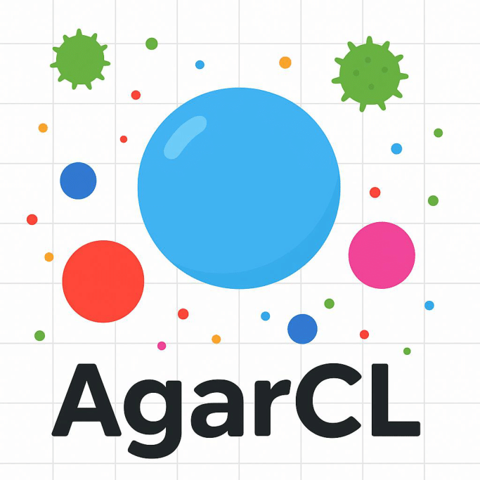
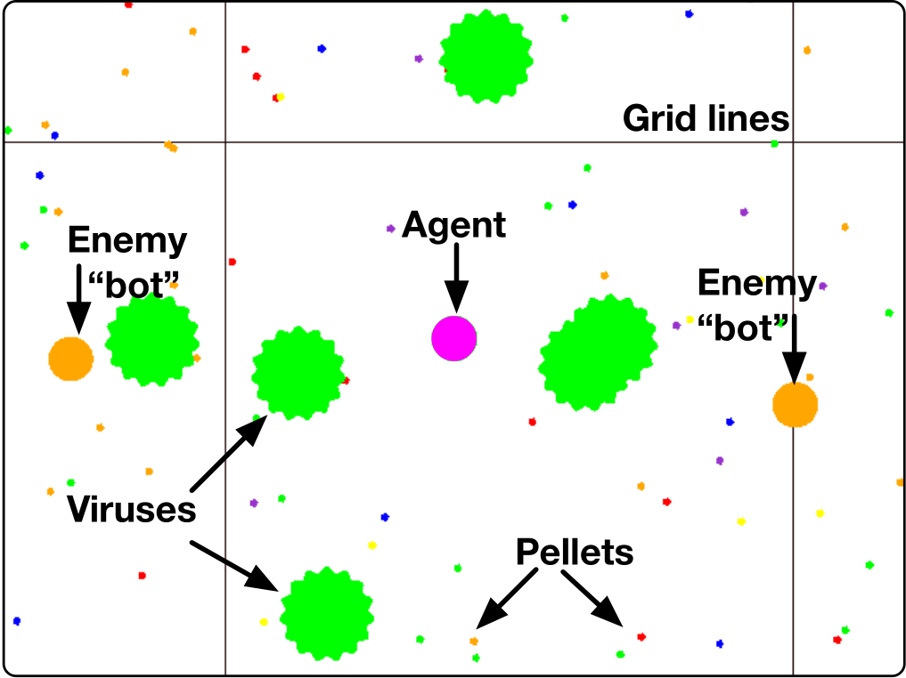

# AgarCL

<div align="center">
    
</div>


A research platform for continual RL that allows for a progression of increasingly sophisticated behaviour.

Please find the documentation [here](https://agarcl.github.io/).

<div align="center">
    
</div>

**AgarCL is based on the game Agar.io.** It's a non-episodic, high-dimensional problem featuring stochastic, ever-evolving dynamics, continuous actions, and partial observability.

## Installation instructions

The recommended way to use AgarCL is within a Docker container running a Linux OS. This ensures there are no conflicts with other installed packages or platforms. This installation script will allow you to interact with AgarCL in a headless mode.

### Setting up the container
Follow these steps to set up the container:

1. **Download the Dockerfile**
   - Download the [Dockerfile.txt](https://github.com/AgarCL/AgarCL/blob/master/Dockerfile.txt).
   - You can jump to step 4 for instructions to use a pre-built [image](https://hub.docker.com/repository/docker/agarcl/agarclimage/general) that we share.

2. **Navigate to the Directory Containing the Dockerfile**
   - Open your terminal and navigate to the folder where the `Dockerfile.txt` is located:
     ```bash
     cd /path/to/Dockerfile/directory
     ```

3. **Build the Docker Image**
   - Build the Docker image by specifying the custom Dockerfile using the `-f` flag:
     ```bash
     docker build -f Dockerfile.txt -t agarclimage .
     ```
   - Skip to step 5, now that your image is built.
4. **Directly use the pre-built image**
   - ```bash
     docker pull agarcl/agarclimage
     ```


5. **Run the Docker Container**
   - Once the image has been built, run the container:
     ```bash
     docker run --gpus all -it --name agarclcontainer agarclimage
     ```
   - This command will start the container with the name `agarclcontainer`. The `--gpus all` flag tells Docker to use all available GPUs on your host system for the container.

### Installing the AgarCL Platform

Now, let's install the platform on your system (`agarclcontainer` container):

1. **Clone the AgarCL Repository**
   - Clone the repository with the `--recursive` flag to ensure all submodules are included:
     ```bash
     git clone --recursive https://github.com/machado-research/AgarCL.git
     ```

2. **Install the Platform**
   - Change into the `AgarCL` directory:
     ```bash
     cd AgarCL
     ```

   - Run the installation command to set up the platform:
     ```bash
     pip install .
     ```

   - This will install the platform in your local user environment.

#### Done!

### Installing the AgarCL Platform and benchmarking tools

1. **Clone the AgarCL-benchmark Repository**
   - Clone the repository:
     ```bash
     git clone https://github.com/AgarCL/AgarCL-benchmark.git
     ```

2. **Navigate to the AgarCL-Benchmark Directory**
   - Change into the `AgarCL-benchmark` directory:
     ```bash
     cd AgarCL-benchmark
     ```

4. **Clone the AgarCL Repository**
   - Clone the `AgarCL` repository with the `--recursive` flag to ensure all submodules are included:
     ```bash
     git clone --recursive https://github.com/machado-research/AgarCL.git
     ```

5. **Navigate to the AgarCL Directory**
   - Change into the `AgarCL` directory:
     ```bash
     cd AgarCL
     ```

6. **Install the Platform**
   - Run the installation command to set up the platform:
     ```bash
     pip install .
     ```

#### Done!

## macOS and Linux Installation Guide

### Installation notes:

Ensure the project is compiled with clang++, not g++

### macOS Installation Guide

> 💡 Before starting:
>
> Follow the instructions [here](https://brew.sh/) and make sure you have **homebrew** correctly installed and updated.
>
> Make sure **Command Line Tools** are installed properly, follow the [documentation](https://developer.apple.com/xcode/resources/).
>
> Note: The installer will automatically install **CMake 3.22** (a compatible version for this project)


Then follow these steps to set up the AgarCL environment on macOS:

1. **Clone the repository:**
   ```bash
   git clone --recursive https://github.com/machado-research/AgarCL.git
   ```
2. **Change into the project directory:**
   ```bash
   cd AgarCL
   ```
3. **Create a Python virtual environment:**
   ```bash
   python -m venv agarclenv
   ```
4. **Activate the virtual environment:**
   ```bash
   source agarclenv/bin/activate
   ```
5. **Run the installer script:**
   ```bash
   ./install.sh
   ```
6. **Install Python dependencies:**
   ```bash
   pip install -r requirements.txt
   ```
7. **Build & install the Python package:**
   ```bash
   pip install .
    ```

#### Done!

### Linux Installation Guide

1. **Clone the repository:**
   ```bash
   git clone --recursive https://github.com/machado-research/AgarCL.git
   ```
2. **Change into the project directory:**
   ```bash
   cd AgarCL
   ```
3. **Create a Python virtual environment:**
   ```bash
   python -m venv agarclenv
   ```
4. **Activate the virtual environment:**
   ```bash
   source agarclenv/bin/activate
   ```
5. **Make the install script executable:**
   ```bash
   chmod +x install.sh
   ```

6. **Run the installer script (may require sudo):**
   ```bash
   sudo ./install.sh
   ```
7. **Install Python dependencies:**
   ```bash
   pip install -r requirements.txt
   ```
8. **Build and install the Python package:**
   ```bash
   pip install .
   ```

## Running the code
To run the Go Bigger example, execute the following line:

```python
python project_path/bench/go_bigger_example.py
```

To run the Screen Observations example, execute the following line:

```python
python project_path/bench/screen_obs_example.py
```

## Configuration reference

All options are passed as keyword arguments to `gym.make`.

### Observation

| option | default | meaning |
|---|---|---|
| `obs_type` | `grid` | `screen` (rendered pixels), `grid` (image-like channel stack), or `gobigger` (structured entity lists) |
| `screen_len` | `84` | width and height of the rendered observation (`screen`) |
| `agent_view` | `False` | `screen` only: return 4 channels (pellets / other players / viruses / own cells + grid lines) instead of RGB |
| `grid_size` | `128` | grid resolution (`grid`) |
| `observe_cells`, `observe_others`, `observe_viruses`, `observe_pellets` | `True` | which channel groups to include (`grid`) |
| `render_mode` | `None` | `rgb_array` or `human` |

### Game

| option | default | meaning |
|---|---|---|
| `arena_size` | `1000` | arena is `arena_size` x `arena_size` world units |
| `num_pellets` | `1000` | target pellet count |
| `num_viruses` | `0` | target virus count |
| `num_bots` | `0` | number of scripted opponents |
| `pellet_regen` | `True` | top pellets/viruses back up to target every 120 ticks (only where the mode permits regeneration) |
| `ticks_per_step` | `4` | action repeat: engine ticks advanced per `step()`, after which the state is observed once |
| `num_agents` | `1` | RL-controlled players; > 1 switches to the multi-agent interface |
| `mode` | `0` | task selector (see below) |

### Episode and reward

| option | default | meaning |
|---|---|---|
| `env_type` | `0` | `0` episodic (truncates at `number_steps`), `1` continuing (never ends) |
| `number_steps` | `500` | truncation limit when `env_type=0` |
| `reward_type` | `1` | `0` reward = current mass, `1` reward = change in mass over the step |
| `c_death` | `0` | penalty subtracted on any step where the agent dies |
| `add_noise` | `True` | add N(0, 0.1) noise to the continuous action before it is applied |

### Actions

An action is `((dx, dy), a)` where `dx, dy` are in `[-1, 1]` and give the
direction to move toward, and `a` is `0` (no-op), `1` (split) or `2` (feed).

### Tasks (`mode`)

Mode `0` is the full continual problem used as the paper's primary setting;
the rest isolate individual skills. Ready-made configurations for each are in
[`bench/tasks_configs/`](bench/tasks_configs).

| mode | task |
|---|---|
| 0 | full game: pellets, viruses, bots, respawning, mass decay |
| 1 | collect pellets arranged in a square, no decay |
| 2 | as 1, with mass decay |
| 3 | reach a target mass (terminates on success) |
| 4 | pellets with regeneration and decay |
| 5, 6 | as 2 and 4, starting at mass 1000 |
| 7–10 | opponent and virus mini-games (episode ends when any player dies) |

## Reproducibility

Seed **before** `reset()`: world generation (pellet and virus placement,
spawn positions) draws from the engine's generator during `reset()`.

```python
import gymnasium as gym
import gym_agario  # registers the agario-* environments

env = gym.make("agario-screen-v0", obs_type="screen")
env.unwrapped.seed(42)   # seed first
obs, info = env.reset()  # then generate the world
```

Given the same seed and the same action sequence, the engine is
deterministic. Note that `add_noise=True` draws from NumPy's global
generator, so seed that too (`np.random.seed(...)`) if you need the noise
reproduced.

## Using the environment


```python
import gymnasium as gym
import gym_agario  # registers the agario-* environments

# Initialise the environment
env = gym.make("agario-screen-v0", render_mode="human")

# Reset the environment to generate the first observation
observation, info = env.reset()
for _ in range(1000):
    # this is where you would insert your policy.
    # an action is ((dx, dy), a) with dx, dy in [-1, 1] and
    # a in {0: noop, 1: split, 2: feed}
    action = env.action_space.sample()

    # step (transition) through the environment with the action
    # receiving the next observation, reward and if the episode has terminated or truncated
    observation, reward, terminated, truncated, info = env.step(action)

    # If the episode has ended then we can reset to start a new episode
    if terminated or truncated:
        observation, info = env.reset()

env.close()
```

### Self-Play setup

In order to play the game yourself or enable rendering in the gym environment, you will need to build the game
client yourself on a system where OpenGL has been installed. Issue the following commands:


```shell
git submodule update --init --recursive
mkdir build && cd build
cmake -DCMAKE_BUILD_TYPE=Release ..
make -j 2 client agario
```

This will output an executable named client in the directory agario

```shell
agario/client
```

Use your cursor to control the agent.


### Loading and Saving Environment Snapshots

AgarCL allows you to save and load snapshots of the environment's state. This feature is useful for debugging, benchmarking, or resuming training from a specific point.

#### Saving a Snapshot

To save the current state of the environment, use the `save_env_state` method:

```python
env.save_env_state('path_to_save_snapshot.json')
```

This will save the environment's state to a JSON file at the specified path.

#### Loading a Snapshot

To load a previously saved snapshot, use the `load_env_state` method:

```python
env.load_env_state('path_to_snapshot.json')
```
Before loading a snapshot, ensure that the `load_env_state` option is enabled in the environment configuration. This will allow the environment to restore its state from the specified JSON file.

#### Example Usage

Here is an example of how to use these methods in a script:

```python
import gymnasium as gym
import gym_agario  # registers the agario-* environments

# Initialize the environment
env = gym.make("agario-screen-v0", render_mode="human")

# Load a snapshot if available
env.load_env_state('snapshot.json')

# Reset the environment
env.reset()

# Perform some steps
for _ in range(100):
   # (dx, dy) in [-1, 1] plus a discrete action: 0=noop, 1=split, 2=feed
   action = env.action_space.sample()
   observation, reward, terminated, truncated, info = env.step(action)
   if terminated or truncated:
      break

# Save the environment's state
env.save_env_state('snapshot.json')

env.close()
```

This functionality ensures reproducibility and allows for efficient experimentation with different configurations.

### Recording and Saving Videos

AgarCL provides functionality to record and save videos of the environment's execution. This is useful for visualizing agent behavior or debugging.

#### Enabling Video Recording

To enable video recording, set the `record_video` parameter to `True` in the environment configuration. You can also enable video recording programmatically:

```python
env.enable_video_recorder()
```

#### Saving the Video

To save the recorded video, use the `generate_video` method:

```python
env.generate_video('path_to_save_video', 'video_name.avi')
```

This will save the video to the specified path with the given file name.

#### Disabling Video Recording

To stop recording, use the `disable_video_recorder` method:

```python
env.disable_video_recorder()
```

#### Example Usage

Here is an example of how to record and save a video:

```python
import gymnasium as gym
import gym_agario  # registers the agario-* environments

# Initialize the environment
env = gym.make("agario-screen-v0", render_mode="rgb_array")

# Enable video recording
env.enable_video_recorder()

# Reset the environment
env.reset()

# Perform some steps
for _ in range(100):
   # (dx, dy) in [-1, 1] plus a discrete action: 0=noop, 1=split, 2=feed
   action = env.action_space.sample()
   observation, reward, terminated, truncated, info = env.step(action)
   if terminated or truncated:
      break

# Save the video
env.generate_video('videos', 'example_run.avi')

# Disable video recording
env.disable_video_recorder()

env.close()
```

### Real-Time Render View

Display the environment in a live GUI window for debugging, demos, and visually tracking your agent’s decisions as they happen.

An example of how to invoke the window:

```python
import gymnasium as gym
import gym_agario  # registers the agario-* environments

# Initialize the environment
env = gym.make("agario-screen-v0", render_mode="human")

# Reset the environment
env.reset()

# Perform some steps
for _ in range(100):
   # (dx, dy) in [-1, 1] plus a discrete action: 0=noop, 1=split, 2=feed
   action = env.action_space.sample()
   observation, reward, terminated, truncated, info = env.step(action)

   # Update the on-screen display
   env.render()
   if terminated or truncated:
      break

env.close()
```


This functionality allows you to capture and analyze the agent's performance visually.

## Troubleshooting

**`cmake_minimum_required` / CMake policy error.** CMake 4.x removed support
for the compatibility range this project declares. Either use CMake 3.x, or
export the policy floor before configuring:

```bash
export CMAKE_POLICY_VERSION_MINIMUM=3.5
```

**Headless rendering on Linux.** Offscreen rendering uses EGL. Set

```bash
export EGL_PLATFORM=surfaceless
```

and make sure the EGL runtime is installed (`libegl1-mesa-dev`, plus
`libgl1-mesa-dri` for software rendering on machines without a GPU).

**`agario-screen-v0` doesn't exist.** The environments are registered when
`gym_agario` is imported, so `import gym_agario` alongside `gymnasium`.

**Compiler.** Build with `clang++`; `g++` is not supported
(`export CXX=clang++`).

## Citation
If you use our environment, cite the following reference:
```
@article{aymanagarcl,
  title={The Cell Must Go On: Agar.io for Continual Reinforcement Learning},
  author={Mohamed A. Mohamed and Kateryna Nekhomiazh and Vedant Vyas,
Marcos M. Jos\'e and Andrew Patterson and Marlos C. Machado},
  journal={https://arxiv.org/abs/2505.18347},
  year={2025}
}
```


## Acknowledgment
This implementation is built upon the [AgarLE repository](https://github.com/jondeaton/AgarLE).
