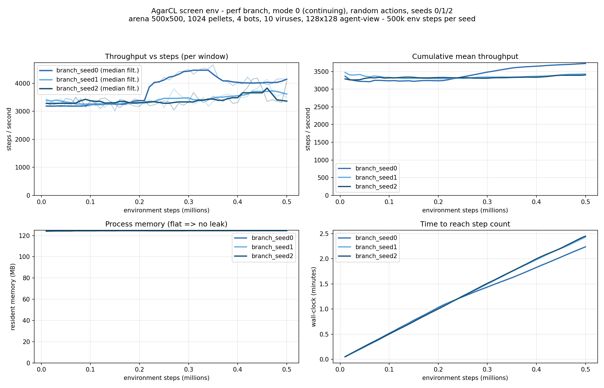
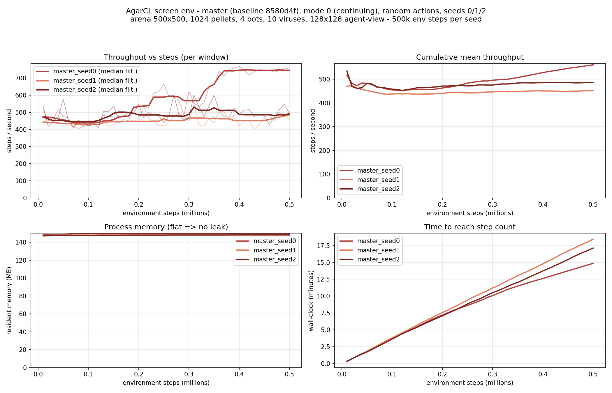
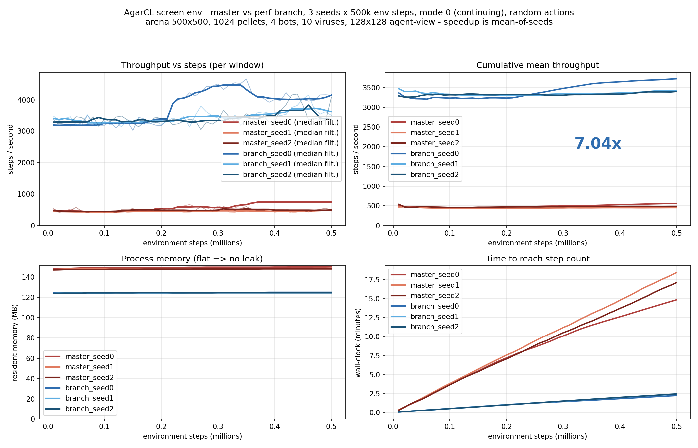

# Throughput benchmark: master vs `perf/rendering-and-engine`

3 seeds x 500,000 environment steps per arm, run sequentially on the same
machine (macOS, Apple Silicon). Random actions.

**Configuration** (full game, as in `bench/screen_obs_example.py`):
mode 0, env_type 1 (continuing), arena 500x500, 1024 pellets, 4 bots,
10 viruses, 128x128 screen observations with `agent_view=True`,
`ticks_per_step=4` (so 500k steps = 2M engine frames per run).

Reproduce with:

```bash
python3 bench/screen_perf_run.py --seed 0 --steps 500000 --window 10000 \
    --num-pellets 1024 --num-bots 4 --num-viruses 10 \
    --out results/branch_500k_s0.csv --label branch_seed0
python3 bench/screen_perf_plot.py --csv results/*.csv --out results/compare.png
```

## Branch arm (`perf/rendering-and-engine`)



| seed | mean throughput | window min-max | RSS first -> last | wall time | resets |
|------|-----------------|----------------|-------------------|-----------|--------|
| 0    | 3,725 sps       | 3,021 - 4,661  | 124.8 -> 125.1 MB | 2.2 min   | 0      |
| 1    | 3,427 sps       | 3,128 - 4,148  | 124.0 -> 124.6 MB | 2.4 min   | 0      |
| 2    | 3,402 sps       | 3,047 - 4,185  | 124.1 -> 124.6 MB | 2.5 min   | 0      |

**Aggregate: 3,518 +/- 180 steps/s** (~284 us/step, ~14,100 engine
frames/s).

Notes:

- No throughput degradation within runs. Late-run windows are 11-26%
  *faster* than early ones, which tracks background load on the machine
  falling during the runs (machine noise, not env warm-up).
- Memory is flat: +0.3-0.6 MB over 500k steps (~125 MB steady). No leak.
- Zero resets across all 1.5M steps, as expected for mode 0 continuing.

## Master arm (baseline, `8580d4f`)



| seed | mean throughput | window min-max | RSS first -> last | wall time | resets |
|------|-----------------|----------------|-------------------|-----------|--------|
| 0    | 561 sps         | 407 - 768      | 148.3 -> 150.1 MB | 14.9 min  | 0      |
| 1    | 452 sps         | 403 - 543      | 147.5 -> 148.7 MB | 18.5 min  | 0      |
| 2    | 486 sps         | 410 - 601      | 147.1 -> 148.1 MB | 17.1 min  | 0      |

**Aggregate: 499 +/- 56 steps/s** (~2,002 us/step, ~2,000 engine frames/s).

## Comparison (mean of 3 seeds)



|                    | master (baseline) | perf branch     | change     |
|--------------------|-------------------|-----------------|------------|
| throughput         | 499 +/- 56 sps    | 3,518 +/- 180 sps | **7.04x** |
| step cost          | 2,002 us          | 284 us          | -86%       |
| engine frames/s    | ~2,000            | ~14,100         | 7.04x      |
| memory (steady)    | ~148 MB           | ~125 MB         | -16%       |
| wall per 500k steps| 14.9 - 18.5 min   | 2.2 - 2.5 min   | ~7x        |

The arms do not overlap anywhere: the slowest branch window (3,021 sps) is
3.9x faster than the fastest master window (768 sps). Both arms are flat
over the full run - no degradation, no leak - and both record zero resets.
The speedup is throughput-only: game semantics are unchanged, and
observations were verified byte-identical between the two builds on
seeded rollouts.

Runs were sequential on the same machine; `loadavg1` is logged per window
in the CSVs to flag contamination from background load. Master's spread
across seeds (+/- 11%) is larger than the branch's (+/- 5%) mostly because
its runs are ~7x longer and integrate more background-load variation.
